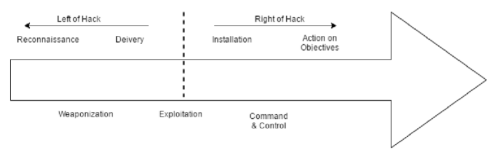

*Risikobewertung*

***Quantitative methoden***

Risikoschätzung in Form eines numerischen Maßes:
       
- Wert der Ressourcen,
- Frequenz der Bedrohungen
- Anfälligkeit gemessen in der Wahrscheinlichkeit eines Verlustes
   

__Vorteile__
   
-akkuraters Bild der Bedrohungen
        
-Konsequenzen eines Vorfalls können in quantitativer Weise
        ausgedrückt werden, was eine Kostenkalkulation erlaubt und
        eine genaue Priorisierung der Maßnahmen begünstigt
        
__Nachteile__

-Ergebnis evtl. ungenau und verwirrend
        
-Analyse mit quantitativen Methoden generell teuerer 
        und erfordert mehr Erfahrung und fortgeschrittene Methoden
        
__Beispiel__

ALE model (Annual Loss Expected)

ALE = (Probability of event) x (value of loss)

Summe aller prognostizierten Verluste
        
        
***Qualitative methoden***

-Beschreibungen, Empfehlungen, 
    
-qualitative beschreibung der Vermögenswerte
     Beschreibung von Angreiger-Szenarien
     
__Vorteile__
     
-Einschätzung der Risiken ohne größeren Aufwand, Zeit und Kosten
        
-Erlaubt eine Einordnung der Risiken nach Priorität
     
__Nachteile__
     
-Keine Bestimmung von Wahrscheinlichkeiten möglich
        
-Kosten-Analyse schwieriger durchzuführen
        
-Resulate sind weniger akkurat und sind mehr geschätzt
        
        
__Beispiel__

FMEA (Failure Mode and Effects Analysis) 

Analyse der Wirkung jeder potenziellen Funktionsstörung des Systems
und eine Rangordnung nach Schweregrad

***Angreifer-Modelle***

__Kill-Chain__

    
Attacke als eine Kette von Aktionen

Sieben Schritte einer Attacke:

Schritt 1: Informationsbeschaffung

Schritt 2: Erzeugen des bösartigen Schadsoftware

Schritt 3: Verschicken der Schadsoftware

Schritt 4: Exploitation

Schritt 5: Installation

Schritt 6: Einrichten eines Kanals zur Kontrolle

Schritt 7: Angreifer erreicht sein Ziel

     
     
     
     
__Attack Graph__
     
  Angreifer hat mehrere Möglichkeiten zu attackieren
     

     
     